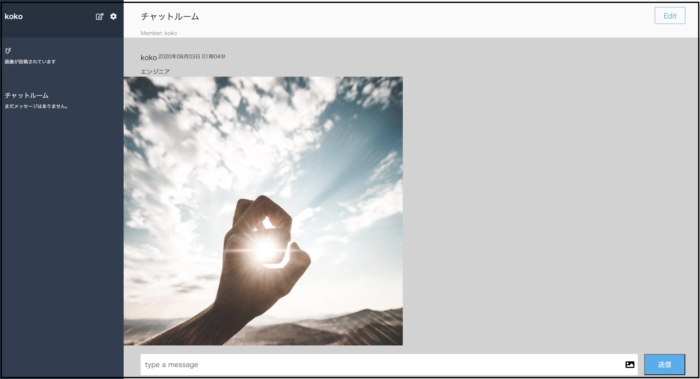

# アプリ概要
## チャット投稿アプリ  

### 詳細説明  
コメント、画像が投稿できるチャットアプリです。  
jQueryを使用し、Ajaxでコメント、写真の投稿を可能にしました。  
### address
http://54.150.10.60/
### テスト用アカウント  
・ユーザー　name:test email:test@mail  
・グループ　name:testgroup  
### 機能
Ajax非同期通信
### 使用技術
### 言語・ライブラリー
・Haml  
・CSS  
・JavaScript  
・jQuery  
・RAILS  
### 環境
・AWS EC2 S3   
・Capistrano 自動デプロイ
### 工夫したポイント
・コメント、写真投稿時、非同期通信で実装しました。  
・新規チャットグループ作成時、チャットメンバー追加をインクリメンタルサーチで実装しました。  
・AWSのS3を利用して画像保存しています。

## groups_usersテーブル

|Column|Type|Options|
|------|----|-------|
|user_id|integer|null: false, foreign_key: true|
|group_id|integer|null: false, foreign_key: true|

### Association
- belongs_to :group
- belongs_to :user

## usersテーブル

|Column|Type|Options|
|------|----|-------|
|name|integer|null: false|
|mail|integer|null: false|

### Association
- has_many :tweets
  has_many :gropus,through,groups_user
  has_many :group_users

## groupsテーブル

|Column|Type|Options|
|------|----|-------|
|name|string|null: false|

### Association
- has_many :tweets  
  has_many :users,through,groups_user  
  has_many :groups_users  

  ## tweetsテーブル

|Column|Type|Options|
|------|----|-------|
|comment|text|null: false|
|image|string|null: false|
|user_id|integer|null: false, foreign_key: true|
|group_id|integer|null: false, foreign_key: true|

### Association
- belongs_to :group  
- belongs_to :user
